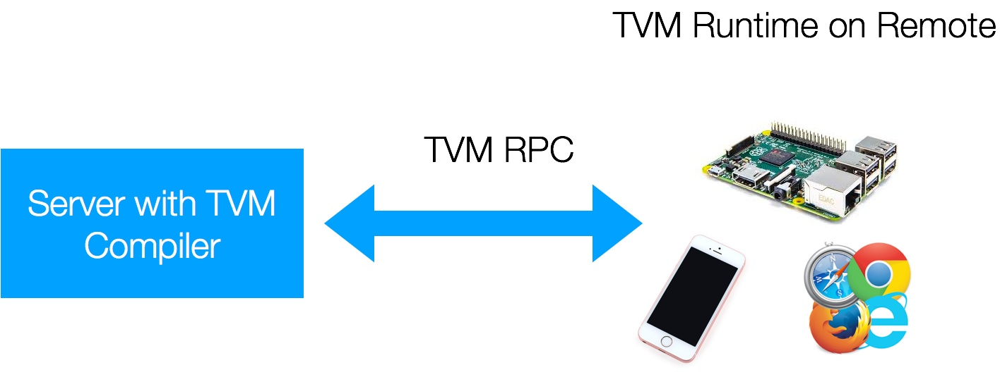

## TVM:An End to End IR Stack for Deploying Deep Learning Workloads on Hardware Platforms

## 1.overview
有了 TVM，业界与学界开发者们可以快速、轻松地在各个系统（包括手机、嵌入式设备与低功耗芯片）上部署深度学习应用程序，同时无须担心资源与速度的限制。*"TVM 作为神经网络和硬件后端之间的共同层，消除了为每类设备或服务器优化各自基础架构的需要。"* TVM 项目负责人陈天奇表示，*"我们的框架允许开发人员快速、轻松地部署和优化大量硬件设备上的深度学习系统。"*

项目链接
[https://github.com/dmlc/tvm](https://github.com/dmlc/tvm)

深度学习如今无处不在且必不可少。这次创新部分得益于可扩展的深度学习系统，比如 TensorFlow、MXNet、Caffe 和 PyTorch。大多数现有系统针对窄范围的服务器级 GPU 进行了优化，并且需要在其他平台（如手机、IoT 设备和专用加速器（FPGA、 ASIC））上部署大量工作。随着深度学习框架和硬件后端数量不断增加，提出了一个统一的中间表征（IR）堆栈，可以弥补以生产力为中心的深度学习框架与性能或效率导向的硬件后端之间的差距。


TVM 是一个全新的框架，它可以解决如下问题：
>1. 优化 CPU、GPU 和其他专业化硬件的常规深度学习的计算量
>2. 自动转换计算图以最小化内存利用率，优化数据布局，融合计算模式
> 3. 提供从现有的前端框架到裸机硬件的端到端编译，一直到浏览器可执行的 Javascript

有了TVM 的帮助，只需少量额外工作我们即可轻易地在手机端、嵌入式设备甚至浏览器上运行深度学习任务。TVM 还为多硬件平台上的深度学习工作负载提供了统一的优化框架，其中包括依赖全新计算原语的专用加速器。


通过采用编译器社区的共同理念，并提供两个中间表征层，我们有效地将高级深度学习算法降低到多硬件后端。在今天的版本中，我们开源了包含 x86、ARM、OpenCL、Metal、CUDA 和 Javascript 优化原语的 TVM 工具包。目前，我们正积极地为专用硬件加速和英伟达的 GEMM 优化的 Volta 架构提供支持。

## 2.技术细节

TVM 堆栈的目标在于提供一个可重复使用的工具链来将高级神经网络描述从深度学习框架前端向下编译为多硬件后端的低级机器代码。拿 Apache MXNet 作为前端的例子，以下代码段演示了如何使用 TVM 将深层学习模型的高级描述编译为针对目标硬件定制的优化可执行模块。
```
# Take mxnet as a demonstration example
import mxnet
# Load existing compilation graph
sym = mxnet.sym.load("resnet.json")#model from framework

m = tvm.bind(sym,target,device,shape={'data':data_shape,'softmax_label':label_shape})#compile

#Run the graph ,possible deploy the module on a separate device.
set_input,run,get_output = m['set_input'],m['run'],m['get_output']
run()#deploy

```
挑战在于支持多个硬件后端，同时将计算、内存和能源足迹（energy footprint）保持在最低水平。我们借鉴了编译器社区的共同理念，以弥合大量深度学习框架和硬件后端之间的差距：我们构建了两级中间层，由NNVM和TVM共同组成。其中前者是用于任务调度和内存管理的顶层中间代码，而后者是用于优化计算内核的、表达力强大的底层中间代码。
堆栈的第一级是基于计算图的表征。计算图是一个有向无环图，其表征作为节点的计算和作为边缘的数据流依赖性。这一表征非常强大：它允许我们将操作属性融入到计算图中，并指定转换规则以迭代优化计算图。这是一个被大多数现有深度学习框架的采用的惯常方法，包括 TVM 堆栈中的 NNVM 图表征、TensorFlow XLA 和英特尔的 ngraph。
很多强大的优化可由图优化框架支持。例如，我们提供了一个子线性内存优化功能，允许用户在单块 GPU 上训练 1000 层的 ImageNet ResNet。然而，我们发现只基于 IR 的计算图并不足以应对支持不同硬件后端的挑战。原因是像卷积或矩阵乘法一样的图运算符可以非常不同的方式映射和优化每个硬件后端。这些特定硬件的优化在内存布局、并行线程模式、缓存访问模式和硬件原语选择方面的变数可能很大。我们希望能够以通用表征的方式明确地表达这些优化旋钮（optimization knob），以有效地导航优化空间。我们构建了一个低级表征以解决这一问题。该表征基于索引公式，并额外支持递推计算。低级 IR 采用现有的图像处理语言（比如 Halide 或 darkroom）的原理以制定一个富有表现力的深度学习 DSL。TVM 构建了由循环转换工具比如 loopy、多面体分析启发的图优化。我们也从深度学习框架比如 MXNet、TensorFlow、Theano 使用的数据流描述语言汲取灵感，然后在调度阶段对 TVM 中描述的算法进行处理，以应用针对目标硬件后端定制的转换。TVM 包括通常出现在 CPU 优化框架中的标准转换原语。更重要的是，TVM 通过利用线程协作模式、数据布局转换和强大的新计算原语，集成了针对 GPU 的全新优化原语。TVM 与 NNVM 的结合为优化软件堆栈中深度学习工作负载提供了一个很好的机会，从而实现了图级别与运算符级别优化的联合计算。

## 3.多语言和平台支持
TVM 的众多优势之一在于它可以支持多种语言和平台。TVM 框架中有两个组件：编译器栈，其中包含完整的优化库以产生优化的机器代码；以及轻量级运行环境，提供在不同平台上部署编译模块所需的可移植性。TVM 目前支持嵌入式编译器堆栈的 Python 和 C++ 接口。我们在设计中最大限度地重用框架，以便编译器堆栈的改进可以在 Python 和 C++ 组件之间互换使用。我们还提供了一个轻量级运行环境，可以在包括 Android、iOS、树莓派和 Web 浏览器在内的平台上直接运行诸如 Javascript、Java、Python 和 C++ 等语言的 TVM 编译代码。

## 4.远程部署和执行
TVM 支持使用 TVM PRC 进行交叉编译，测试嵌入式设备，这是一种轻量级界面，用于在远程嵌入式设备上部署和执行 TVM 交叉编译模块。我们 TVM 用户提供了易用的高级 Python 界面，用于在各种低级嵌入式设备上进行远程编译、优化，并测试深度学习算法。

## 5.性能
TVM 目前仍然处在早期发展阶段，我们会在未来看到更多改进，但目前它已经展现出了强大的实力。TVM 为我们提供了灵活性，让我们可以探索不同硬件平台上，不同深度学习内核中丰富的优化空间。例如，TVM 允许我们裁剪数据布局，为内核与平台融合模式需求。注意，构建基线库可用于更通用的问题，而 TVM 的优化内核通过自动调整过程对人们评估的工作负载进行了大量调整。TVM 可以作为快速生成专属内核的绝佳工具。

## 6.开源

TVM 始于华盛顿大学 Paul G. Allen 计算机科学与工程学院的研究项目。它被设计成支持 DLPack——一个被多种深度学习框架共享的张量数据结构。在开发过程中，我们得到了来自华盛顿大学、AWS、奇虎 360、Facebook、香港科技大学、图森未来、UCDavis、上海交大以及 DMLC 开源社区和 DLPack 计划成员们的支持。展望未来，该项目将继续遵循 Apache 开源模式，力图构建一个由社区维护的项目，欢迎大家的参与。


## 相关链接
[http://tvmlang.org/2017/08/17/tvm-release-announcement.html](http://tvmlang.org/2017/08/17/tvm-release-announcement.html)
[http://tvmlang.org/2017/08/22/Optimize-Deep-Learning-GPU-Operators-with-TVM-A-Depthwise-Convolution-Example.html](http://tvmlang.org/2017/08/22/Optimize-Deep-Learning-GPU-Operators-with-TVM-A-Depthwise-Convolution-Example.html)
